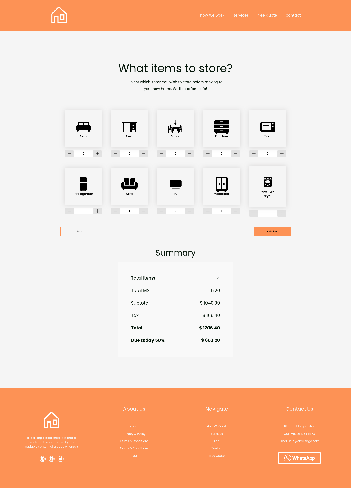

# Frontend-challenge

> Static Page allows users to calculate payment counting furniture storage. 

[Design preview](https://www.notion.so/Proficient-MTY-89d093bfe0804be7bc8ca3522558e083#5b81d4243b154e7aab22f084aee59b5c)

## Built With

 
 

## Getting Started

To get a local copy up and running follow these simple example steps.

### Prerequisites

Node.js

## Setup

### Create local instance

You can run it on your local machine by cloning the project.

- Click on the green "Code" button
- Copy the link
- On your Terminal run `git clone $<LINK>` replacing `$<LINK>` with the link you just copied.
- cd to the folder where you cloned the repo
- Now you can run the commnads below as needed.

### Usage

### 1. `yarn install`

Install all the dependencies needed for the project to work correctly.

### 2. `yarn dev`

Runs the app in the development mode.\
Open [http://localhost:3000](http://localhost:3000) to view it in your browser.

The page will reload when you make changes.\
You may also see any lint errors in the console.

## Authors

👤 Oscar Garrido

- GitHub: [alef-garrido](https://github.com/alef-garrido)
- Twitter: [Alef_Garrido](https://twitter.com/Alef_Garrido)
- LinkedIn: [Oscar Garrido](https://www.linkedin.com/in/garrido-armando)

## Acknowledgments 🤝

- This project was bootstrapped with [Vite](https://vitejs.dev/guide/)

## 📝 License

This project is [MIT](./LICENSE.md) licensed.

